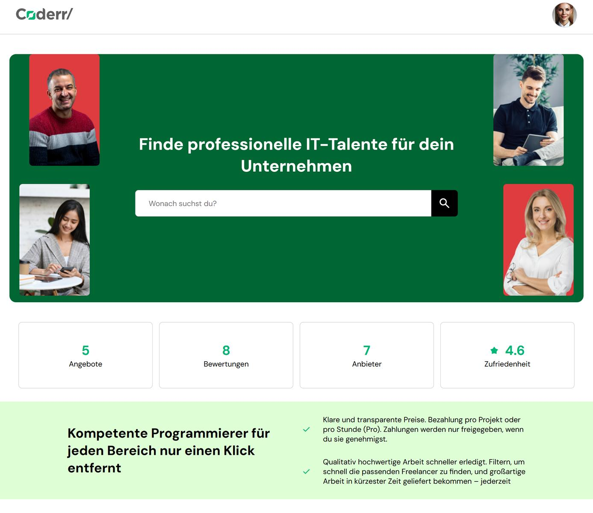
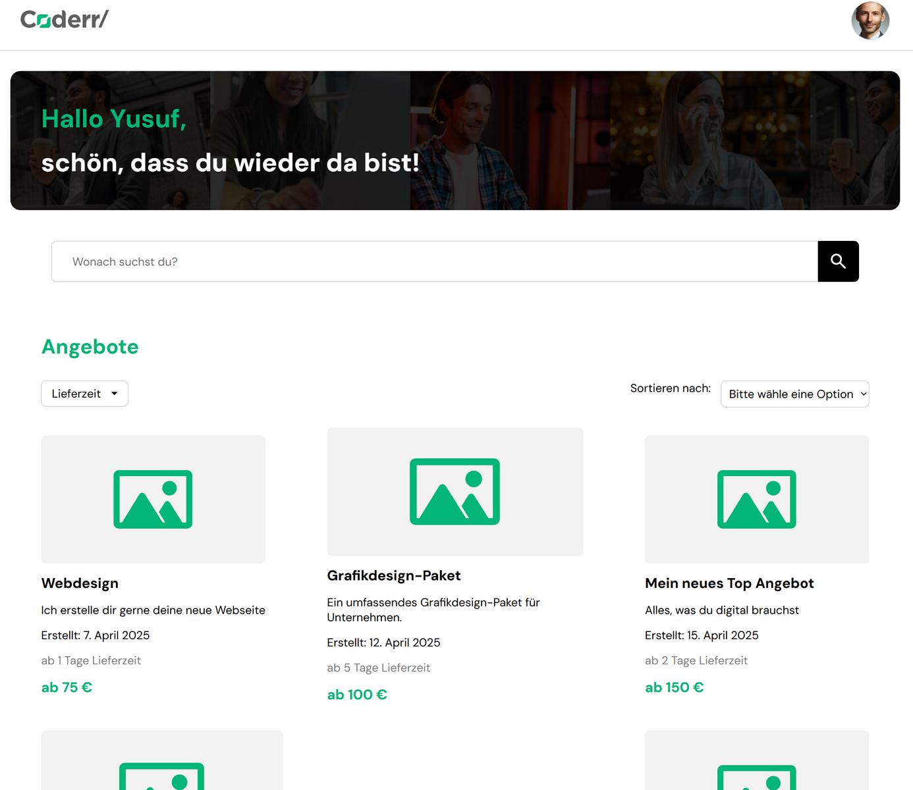
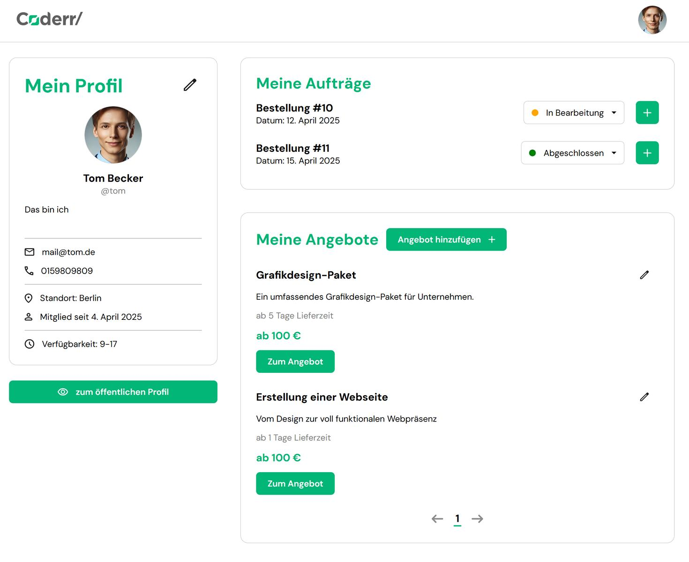
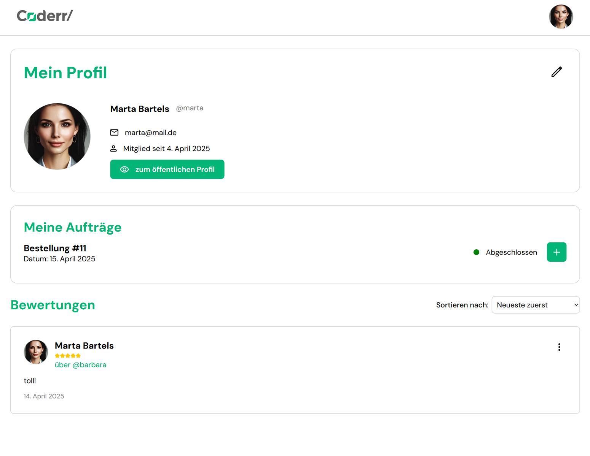

# Coderr Backend

## 📌 Project Description

The **Coderr Backend** powers the developer service platform **Coderr**.  
It enables **programmers (Business Users)** and **clients (Customer Users)** to register, create and browse offers, place orders, leave reviews, and manage their profiles. 

You can explore the application using a **guest login**, available for both user roles.

> 🔗 **[Frontend-Repository (V1.2.0)](https://github.com/Developer-Akademie-Backendkurs/project.Coderr)** <br>
> 🔗 **[Frontend-LiveTest](https://annafritz.de/coderr/)** <br>
> 📖 **[API-Dokumentation (Swagger)](https://cdn.developerakademie.com/courses/Backend/EndpointDoku/index.html?name=coderr)**

---

## 🛠 Installation & Setup

### System Requirements

- **Python:** 3.13.1
- **Django:** 5.1.7
- **Django REST Framework:** 3.15.2

### Dependencies (from `requirements.txt`)

```
asgiref==3.8.1
coverage==7.8.0
Django==5.1.7
django-cors-headers==4.7.0
django-filter==25.1
djangorestframework==3.15.2
sqlparse==0.5.3
tzdata==2025.1
```

### Installation Steps

1. Clone the repository:
   ```sh
   git clone https://github.com/Anna-Fritz/coderr_backend.git
   cd coderr_backend
   ```

2. Create and activate a virtual environment:
   ```sh
   python -m venv venv
   source venv/bin/activate  # On Windows: venv\Scripts\activate
   ```

3. Install dependencies:
   ```sh
   pip install -r requirements.txt
   ```

4. Apply database migrations:
   ```sh
   python manage.py migrate
   ```

5. Start the development server:
   ```sh
   python manage.py runserver
   ```

---

## 📂 Database & Migrations

- **Database Technology:** SQLite (default, can be switched to PostgreSQL or MySQL if needed).
- **Run Migrations:**
  ```sh
  python manage.py migrate
  ```

---

## 🧪 Running Tests

To execute the test suite:

   ```sh
   python manage.py test
   ```

To execute the test suite with coverage:

   ```sh
   coverage run manage.py test
   ```

To check the coverage report:

   ```sh
   coverage report
   ```

---

## 📸 Screenshots

<p align="center">
  
</p>
<p align="center">
   
</p>
<p align="center">
   
</p>
<p align="center">
   
</p>

---

## 📝 License

This project is licensed under the **Creative Commons Attribution-NonCommercial 4.0 International (CC BY-NC 4.0)**.

- **Share:** You may copy and redistribute the material in any format or medium.
- **Adapt:** You may remix, transform, and build upon the material.
- **Non-Commercial:** You may not use the material for commercial purposes.

For full details, see the [official license documentation](https://creativecommons.org/licenses/by-nc/4.0/).

---

## 👩‍💻 Author

Developed and maintained by [Anna](https://github.com/Anna-Fritz).
